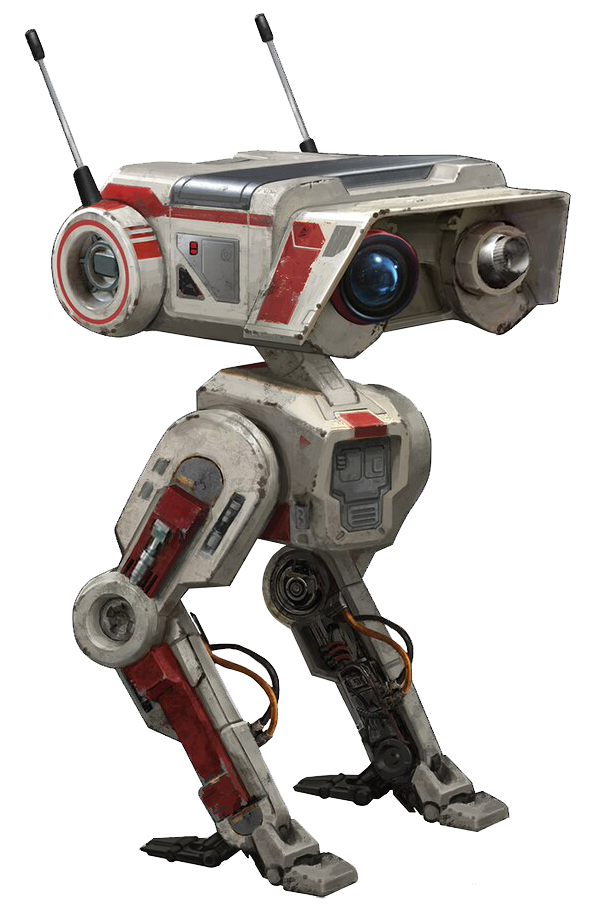
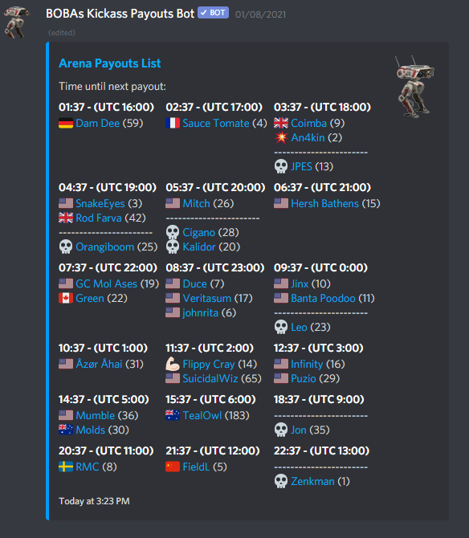
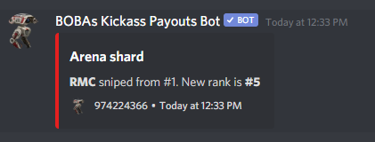
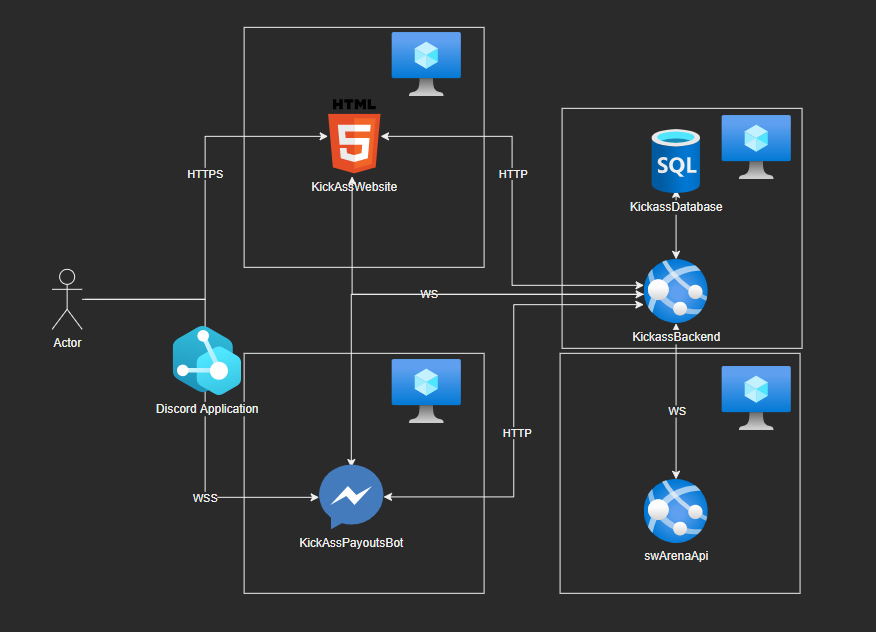
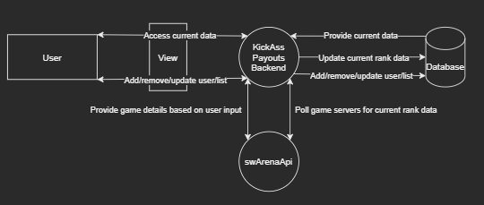
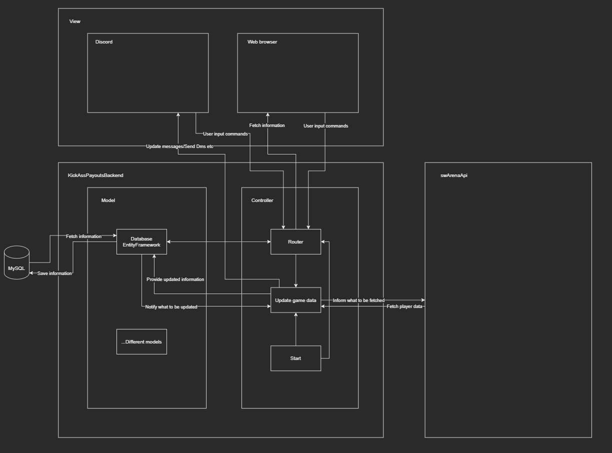
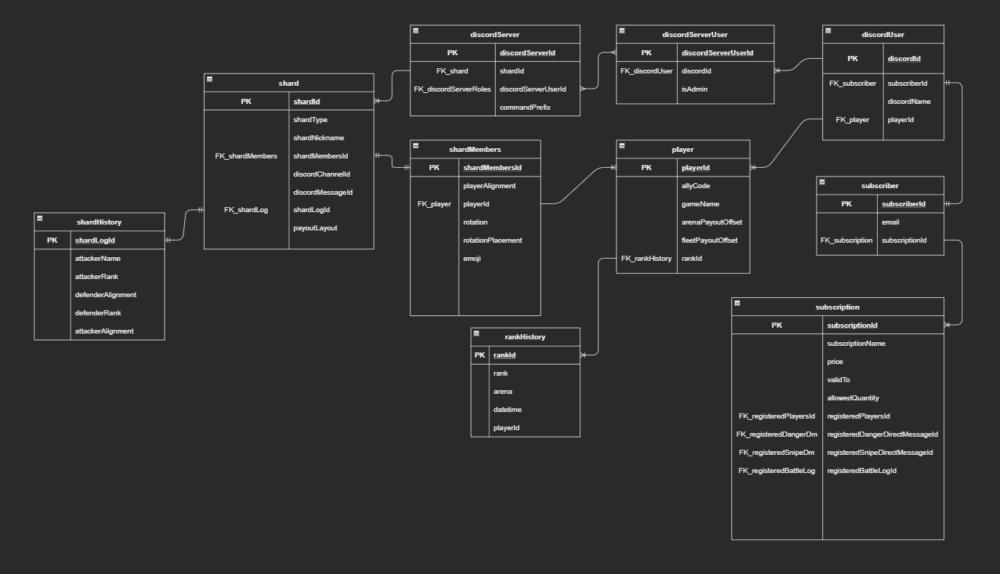

# KickAssProject

[[_TOC_]]

## Explaining the business case
Due to the popularity of the mobile game [Star Wars Galaxy of Heroes](https://www.ea.com/games/starwars/galaxy-of-heroes) and the game developers not prioritizing certain player needs, the author of this design project identified a few areas that could help the whole player base. Back in July 2020 a work began of reverse engineering the game to understand how packages are sent between the client and game server to see what kind of data could be retreived through an self-developed backend. After many hours of frustration reading up on [serilization](https://en.wikipedia.org/wiki/Serialization), [protobuffers](https://developers.google.com/protocol-buffers) and [RPCs](https://en.wikipedia.org/wiki/Remote_procedure_call) the project KickAssProject was born to help the general player base of the game.

### Game mechanics to expand upon
The game has different arenas where players that belong to the same "shard" (a bracket of around 50 000 players) can combat other players to get a better arena placement. At a certain point in time a payout is made based on the current arena placement. There is therefore an incentive to have the best arena placement to get the biggest reward. This payout-time is different for each player (but different payout times can be shared between persons causing them to compete), and there is no way of telling who has which payout through the game interface. This means that players that doesn't have close payout might harm other players that have a payout in the next hour. The player base quickly understood this and different shard chats were formed outside of the game to better synchronize and make sure that no-one is harmed in their own payout hour, maximizing the payouts for all players.

### Discord as the main communication method
Since the beginning Discord has been the main communication method for these shard chats and there have been different ways of displaying when everyone has their different payout times, but the most basic form was lists where everyone had to write their own payout time.

### How to help the player base
In order to help player base as much as possible a Discord bot was created, called "KickAss Payouts Bot", expanding upon the reverse-engineered solution, which was supposed to show live payouts data (updating every other minute) as well as direct message users whenever they lose rank in-game. Due to the author being junior at the time the solution might not have been the best one from both an architectural standpoint but also code quality. There are many other features to the original bot, but these two (Live Payout Data and DM on drop) the areas in scope for this course. The below pictures illustrates how the bot is functioning today where a message is updated for each shard chat to illustrate live payout data and a direct message is sent to a user on drop.

 

## Overall structure of the application

The application consist of four different virtual machines hosted on my own dedicated server that are communicating with each other in different ways. In its core an MVC architectural pattern has been choosen clearly seperating different virtual machines into either Model/Controller or View. A sense of event-driven architecture can also be seen since the backend (KickAssBackend) is suppose to communicate with primarily the discord view through a websocket, telling the application when to communicate either through editing a shard payout message or direct messaging a user that their rank has dropped. Secondly a website will be created where users can login through Discord OAuth and see all shards/servers that they have access to. Finally the application communicating with the game server (swArenaApi) can be seen as a microservice, as its sole purpose is to fetch data from the game server based on input, and it has a very standardized way of doing so (through websockets).

## Frontend

## Backend
### **Data flow diagram**
Please see the attached schemas around the dataflow.

### **KickAssPayoutsBackend**

**Description**
 
A web API capable of persisting user preferences and user input to a MySQL database, as well as specifying data to be retreived by API. The backend should continuously poll the game servers through the swArenaApi websocket in order to save and store data needed to be provided. Whenever data is accessed through the API the most current data is sent back for that perticular request (being either Discord or web browser).

**Frameworks and dependencies**
 
ASP.Net Core will be used as a web application framework in order to easily handle the creation and usage of APIs.
In order to satisfy an easy way of communicating with the MySQL database the MySQLConnector package has been choosen as a serve-side framework.
To create on the fly documentation around the web API created Swashbuckle.AspNetCore will be used. Swashbuckle is an open source project for generating Swagger documents for Web APIs that are built with ASP.NET Core.
A project SDK, Microsoft.NET.Sdk.Web, is used for easy build and deployment as a dotnet webapp.

**Persistent data**
 
The value of this application comes through the consistant polling of current data which only few people can access through a computer backend. In order to support user preference as well as the added value of data history a database is needed to persist data. For this project a MySQL database has been selected as a database. Please see the attached database schema around how the database should be structured.

**API**
 
The value of this application comes through the consistant polling of current data which only few people can access through a computer backend. In order to support user preference as well as the added value of data history a database is needed to persist data. For this project a MySQL database has been selected as a database. Please see the attached database schema around how the database should be structured.

### **swArenaApi**
**Description**
 
An application built in Node.JS able to communicate with the Star Wars Galaxy of Heroes game servers using the RPC protocol. The application is wrapped around a websocket enabling fast and consistant communication with whichever service that connects to it (currently only the KickAssPayoutsBackend service). This project is the core of the architecture and quite a few trade secrets are stored within its source-code. As such this code will not be pushed to the repository in the final handin of the project.

**Frameworks and dependencies**
 
In order to serilize and deserilize requests from and to the games servers the protobufjs framework is used to translate data structures into readable JSON objects.
As mentioned above the application is wrapped around a websocket, as such the ws dependency is used.
To create make calls to the games RPC node-fetch has been chosen as a dependency.