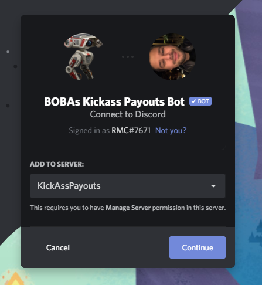

# KickAssProject

[[_TOC_]]

## Explaining the business case
Due to the popularity of the mobile game [Star Wars Galaxy of Heroes](https://www.ea.com/games/starwars/galaxy-of-heroes) and the game developers not prioritizing certain player needs, the author of this design project identified a few areas that could help the whole player base. Back in July 2020 a work began of reverse engineering the game to understand how packages are sent between the client and game server to see what kind of data could be retreived through an self-developed backend. After many hours of frustration reading up on [serilization](https://en.wikipedia.org/wiki/Serialization), [protobuffers](https://developers.google.com/protocol-buffers) and [RPCs](https://en.wikipedia.org/wiki/Remote_procedure_call) the project KickAssProject was born to help the general player base of the game.

### Game mechanics to expand upon
The game has different arenas where players that belong to the same "shard" (a bracket of around 50 000 players) can combat other players to get a better arena placement. At a certain point in time a payout is made based on the current arena placement. There is therefore an incentive to have the best arena placement to get the biggest reward. This payout-time is different for each player (but different payout times can be shared between persons causing them to compete), and there is no way of telling who has which payout through the game interface. This means that players that doesn't have close payout might harm other players that have a payout in the next hour. The player base quickly understood this and different shard chats were formed outside of the game to better synchronize and make sure that no-one is harmed in their own payout hour, maximizing the payouts for all players.

### Discord as the main communication method
Since the beginning Discord has been the main communication method for these shard chats and there have been different ways of displaying when everyone has their different payout times, but the most basic form was lists where everyone had to write their own payout time.

### How to help the player base
In order to help player base as much as possible a Discord bot was created, called "KickAss Payouts Bot", expanding upon the reverse-engineered solution, which was supposed to show live payouts data (updating every other minute) as well as direct message users whenever they lose rank in-game. Due to the author being junior at the time the solution might not have been the best one from both an architectural standpoint but also code quality. There are many other features to the original bot, but these two (Live Payout Data and DM on drop) the areas in scope for this course. The below pictures illustrates how the bot is functioning today where a message is updated for each shard chat to illustrate live payout data and a direct message is sent to a user on drop.

 
## Architectural patterns
There are a lot to think about when deciding which architecture pattern to use for an application. Most of the time it would be recomendet to go for one of the predefined [Architecture Patterns](Architecture-Patterns), since not doing so could easily lead to the use of one of the well know anti-patterns (e.g. BBoM, or "Big Ball of Mud") [1].

Research was made, around the different predefined patterns that can be used as well as the pros and cons of using these patterns. Looking at the needs of my application I quickly fell for the **layerd based design** toppled of with some **event-driven aspects** as well as one part of the application being a **microservice**. This was due to the challenges faced when building this application as a monolith. Some of the experienced problems were the fact that I had to poll the backend when to send a message and everything was beginning from the frontend in this aspect instead of originating from the backend.

By clearly seperating the application into layers (e.g. bot being the view and backend being a model/controller), I feel that the application has a better structure and divided responsibility. This will make the different parts smaller and easier to handle and debug [2]. I also like the fact that I would be able to avoid polling by instead opting for a more event-drive design [3]. I was planning to solve this through a websocket where the bot would connect to the backend and receive messages whenever it is suppose to act. This could be seen as a simplified handling of the observer pattern [3]. A few areas of the application cant avoid the polling scenario, this is due to the fact that there is no way to receive info on an event-basis from the game servers. The microservice that pulls game data will do this through the use of polling and keeping data up to date in the database, so whenever data is requested it is pulled from the database containing fresh data.

## Overall structure of the application

Below a picture of the overall structure of the application can be shown where the first two "boxes" are the frontend that are communicating in different ways with the two back "boxes" as the backend.

1. The application will consist of four different virtual machines hosted on my own dedicated server that are communicating with each other in different ways.
2. In its core an MVC architectural pattern has been choosen clearly seperating different virtual machines into either Model/Controller or View.
3. A sense of event-driven architecture can also be seen since the backend (KickAssBackend) is suppose to communicate with primarily the discord view through a websocket, telling the application when to communicate either through editing a shard payout message or direct messaging a user that their rank has dropped.
4. Secondly a website will be created where users can login through Discord OAuth and see all shards/servers that they have access to.
5. Finally the application communicating with the game server (swArenaApi) can be seen as a microservice, as its sole purpose is to fetch data from the game server based on input, and it has a very standardized way of doing so (through websockets).

Please see the below high level dataflow overview showing this.

This pretty much sums up how the user interacts with the application on a very high level.

1. User interacts with frontend.
2. Game data gets added from the game servers.
3. Data gets pushed/pulled to/from the database.

## Frontend
The frontend consist of two different areas, one discord interface, where the user can login through the discord application, invite the KickAssPayoutsBot to their server and set up the bot to provide the data that is requested. Secondly a React.JS application is used to allow the user to login through Discord OAuth to show the same information as prodvided in the discord application.

The different views are communicating with the backend through web APIs and websockets as per the below endpoints (please see below under the backend section). Below an illustration of the frontend application can be shown.

### **Discord**

#### Description
A bot is created in Node.JS using the popular Discord.JS framework, which is wrapping Discords own APIs to communicate to Discord easily (e.g. sending messages, receive and interpet messages etc). By creating a discord bot I can simulate a user that can communicate just like any other person. The focus of the application will lie in this part of the frontend.

#### Frameworks and dependencies
Discord.JS will be used to easily handle discords complex API structure and to easily create a bot that can listen to and act upon commands of the user.

#### Explaining the Discord View flow
1. The user logs into the application in Discord to identify itself as a specific user. 

2. The user invites the bot using and invite link to its server to be able to communicate with the bot. 

3. The user sets up the bot by entering different commands, like creating shards, adding users opting in for direct messages etc. The bot would listen for certain commands and send requests through to the backend using a rest API where data would be stored/processed to set up the bot for that specific shards purpose (see below).

1. The bot is connected to the backend through a websocket and receives messages whenever it needs to act (e.g. update a message or send a direct message to a user) (see below).

#### Bot commands
In order to receive and update data to the backend commands are typed by the user which will trigger different rest API requests.

| Command                              | Triggers endpoint | Method | Description                           | Example                         |
| ------------------------------------ | ----------------- | ------ | ------------------------------------- | ------------------------------- |
| !createshard "type" "#shardname"     | /shards/create    | POST   | Create a new shard                    | !createshard ARENA #payouts     |
| !changeshardtype "#shardname" "type" | /shards/change    | PUT    | Change shard type                     | !changeshardtype #payouts FLEET |
| !removeshard "#shardname"            | /shards           | DELETE | Delete a shard with a specific ID     | !removeshard #payouts           |
| !add "allycode" "#shardname"         | /players/add      | POST   | Add a new player to a specific shard  | !add 123123123 #payouts         |
| !remove "allycode" "#shardname"      | /players          | DELETE | Delete a player from a specific shard | !remove 123123123 #payouts      |

#### Websocket purpose
The event-driven architecture comes from the backend telling the frontend when to perform different actions. The bot will from start be connected through the /websocket endpoint (see below under API) to the backend via websocket and listen from different events. In order for minimal data to be sent over the websocket only the event type and enough data to perform an REST API request will be sent, but the bot is instructed to perform get requests to receive the data needed to perform the send/direct message action.

The following endpoints will be used by the bot in connection to the websocket.
| Component | Endpoint              | Method | Description                               |
| --------- | --------------------- | ------ | ----------------------------------------- |
| Shards    | /shards/{id}          | GET    | Fetch shard information for a specific ID |
| Players   | /players/{id}/history | GET    | Fetch rank history from a specific player |

### **Webbrowser**
#### Description
A webpage is created using the popular React.JS framework to create a SPA application. The user is supposed to login using Discords OAuth service  and by doing this information is sent to backend on which servers the user has access to (in order to show the correct shards that has been created through Discord). The webpage will not be focused on in this project, but rather demonstrating the important and powerful OAuth technology [4].

#### OAuth
OAuth is a very powerful way of providing clients with secure access to the user resources on a service provider [5]. It basically allows access management to be handled by another known provider (e.g. Google, Facebook or in this case Discord). The flow is explained below of the well known Authorization Flow Grant [5].

Picture from [6].

1. The first step would be that the client requests authorization from the resource owner (through e.g. providing a link on a homepage that will take the user to the providers login page).
2. After successfully logging in the client receives an authorization grant code from the URI.
3. The client requests an access token by performing a POST request with the help of the authorization server and authorization grant provision. The settings when setting up the OAuth decided on the access that is provided, and this is also shown to the user in step 1.
4. The authorization server verifies the client by checking the authorization grant code and, if it’s valid, issues an access token and refresh token as a response to the POST request.
5. The client requests a secure resource (e.g. GET/POST request) from the provider and authenticates by presenting the access token in the header of the request.
6. The provider checks the access token and, if valid, serves the request.

#### Frameworks and dependencies

As mentioned above React.JS will be used to create a simple SPA application.

#### Explaining the Webpage View flow
1. The user accesses the webpage.
2. The user logs in through Discord OAuth.
3. The user is displayed all shards and the current payout information for these shards by calling the specific endpoints

## Backend

### **KickAssPayoutsBackend**

#### Description
A web API capable of persisting user preferences and user input to a MySQL database, as well as specifying data to be retreived by API. The backend should continuously poll the game servers through the swArenaApi websocket in order to save and store data needed to be provided. Whenever data is accessed through the API the most current data is sent back for that perticular request (being either Discord or web browser).

#### Frameworks and dependencies
ASP.Net Core will be used as a web application framework in order to easily handle the creation and usage of APIs.
In order to satisfy an easy way of communicating with the MySQL database the MySQLConnector package has been choosen as a serve-side framework [7].
To create on the fly documentation around the web API created Swashbuckle.AspNetCore will be used. Swashbuckle is an open source project for generating Swagger documents for Web APIs that are built with ASP.NET Core [8].
A project SDK, Microsoft.NET.Sdk.Web, is used for easy build and deployment as a dotnet webapp.

#### API
The backend has a few endpoints to handle the users request to add/remove and update data.

| Component | Endpoint              | Method | Description                                    |
| --------- | --------------------- | ------ | ---------------------------------------------- |
| Oauth     | /discord-login        | GET    | User login through a redirect to Discord login |
| Oauth     | /discord-redirect     | GET    | Callback redirect after login                  |
| Shards    | /shards               | GET    | Fetch all shard information                    |
| Shards    | /shards/{id}          | GET    | Fetch shard information for a specific ID      |
| Shards    | /shards/create        | POST   | Create a new shard                             |
| Shards    | /shards/change        | PUT    | Change shard type                              |
| Shards    | /shards               | DELETE | Delete a shard with a specific ID              |
| Players   | /players/{id}/history | GET    | Fetch rank history from a specific player      |
| Players   | /players/add          | POST   | Add a new player to a specific shard           |
| Players   | /players              | DELETE | Delete a player from a specific shard          |
| WebSocket | /websockets           | GET    | Connect to the websocket server                |

#### Persistent data
The value of this application comes through the consistant polling of current data which only few people can access through a computer backend. In order to support user preference as well as the added value of data history a database is needed to persist data. For this project a MySQL database has been selected as a database. Please see the attached database schema around how the database should be structured, as well as an explaination on the most important attributes.

1. There can be many different shards containing data like shard type, shardServerId (in this case which discord server it is) as well as shardId (which discord channel it is on that server). The discord channel was chosen as a primary key since this is unique and would enable the user to create as many shards as there are channels on the specific discord server. There is a downside of structuring the data using discord, since I am dependent on the user using discord, however this can be overcome by providing similar IDs structures when the user doesnt have a discord account. The discord channel IDs are unique accross the whole of discord, so there is no possibility of duplications.
2. The shard can contain shardmembers which contains information around if the member is a friend or enemy as well as a reference to a player. The primary key is an auto incremental number that increases by one each time a member is added.
3. The shard meembers are also players which contain the in game information fetched from the game server. The primary key playerId is a combination of the shardid and allycode making each playerId unique.
4. Lastly there are two tables showing rank/hit history. Since I want to keep track on the who hit whom I need the shardhistory table to provide that data. I also want to know the ranks of different players so the bot needs to message users when this is to happen.

### **swArenaApi**
#### Description
An application built in Node.JS able to communicate with the Star Wars Galaxy of Heroes game servers using the RPC protocol. The application is wrapped around a websocket enabling fast and consistant communication with whichever service that connects to it (currently only the KickAssPayoutsBackend service). This project is the core of the architecture and quite a few trade secrets are stored within its source-code. As such this code will not be pushed to the repository in the final handin of the project.

#### Frameworks and dependencies
In order to serilize and deserilize requests from and to the games servers the protobufjs framework is used to translate data structures into readable JSON objects.
As mentioned above the application is wrapped around a websocket, as such the ws dependency is used.
To create make calls to the games RPC node-fetch has been chosen as a dependency.

## Post-implementation reflection
There was one major change to the plan above - the KickAssPayoutsRankWorker. When reading up on the different project templates that existed for C# and DotnetCore I stumbled upon the [**worker service**](https://docs.microsoft.com/en-us/aspnet/core/fundamentals/host/hosted-services?view=aspnetcore-5.0&tabs=visual-studio) template - a perfect usercase for any background processing.

Since one part of the KickAssPayoutsBackend was planned to be a polling service to fetch and update rankdata on a timely basis (a minute at most) I saw a potential way to break up my project into smaller and more specialized pieces by implementing a service worker to handle these parts of the application.

The implementation worked perfectly, but required access to both the websocket server in the backend (to communicate event driven to the KickAssPayoutsBot) as well as the swArenaApi. A through I had was to further break up the application by creating a websocket server that only handled the service of relying messages. Due to time contstraints this was not implemented.

Few other areas were changed. But smaller changes were made to both the API and the database model as illustraded below.

### API
Primarily a few more endpoints were created to satisfy the need for new data or to change the data that was not foreseen when writing the original system design specification.

| Component | Endpoint                  | Method | Description                                              |
| --------- | ------------------------- | ------ | -------------------------------------------------------- |
| Discord   | /loginurl                 | GET    | Receive the login url to redirect to discord             |
| Discord   | /eschangecode             | GET    | Exchange code to receive access token                    |
| Discord   | /servers                  | GET    | Get all servers the logged in user has access to         |
| Shards    | /shards                   | GET    | Fetch all shard information                              |
| Shards    | /shards/{shardId}         | GET    | Fetch shard information for a specific ID                |
| Shards    | /shards/create            | POST   | Create a new shard                                       |
| Shards    | /shards/change-shard      | PUT    | Change shard type                                        |
| Shards    | /shards/change-message-id | PUT    | Change the id of the message to be updated               |
| Shards    | /shards/list              | POST   | Receive all shards based on an input array of server ids |
| Players   | /players/change           | PUT    | Update the discord ID to receive direct messages         |
| Players   | /players/add              | POST   | Add a new player to a specific shard                     |
| Players   | /players                  | DELETE | Delete a player from a specific shard                    |
| WebSocket | /ws                       | GET    | Connect to the websocket server                          |

### Database model
The database model was simplified to since it was to complex for the scope of the assignment. Furthermore a view was created that has not been illustrated above in order to simplify access to needed data. When continuing the work, I will probably only develop different views and not focus on querying different tables since this would simplify changes to the application even more.

## References
[1] The Big Ball of Mud and Other Architectural Disasters, Jeff Atwood, 26 Nov. 2007,  https://blog.codinghorror.com/the-big-ball-of-mud-and-other-architectural-disasters/
(accessed Feb. 20, 2021).

[2] The top 5 software architecture patterns: How to make the right choice, Peter Wayner,  https://techbeacon.com/app-dev-testing/top-5-software-architecture-patterns-how-make-right-choice (accessed Feb. 20. 2021).

[3] Understanding the Observer Design Pattern, Carlos Caballero, 22 Jan. 2021,
https://medium.com/better-programming/understanding-the-observer-design-pattern-f621b1d0b6c9 (accessed Feb. 20, 2021).

[4] A Simple Way to Understand OAuth, Chameera Dulanga, 26 Jun 2020, https://medium.com/better-programming/a-simple-way-to-understand-oauth-169d49e0b328 (accessed Feb. 20, 2021).

[5] https://tools.ietf.org/html/rfc6749#section-1.3.1 (accessed Feb. 20, 2021).

[6] Oauth 2.0 Basic Understanding, Oleksii Andrukhanenko, 17 March, 2020, https://stfalcon.com/en/blog/post/oauth-2.0 (accessed Feb. 20, 2021).

[7] https://mysqlconnector.net/ (accessed Feb. 20, 2021).

[8] https://github.com/domaindrivendev/Swashbuckle.AspNetCore/blob/master/README.md (accessed Feb. 20, 2021).
